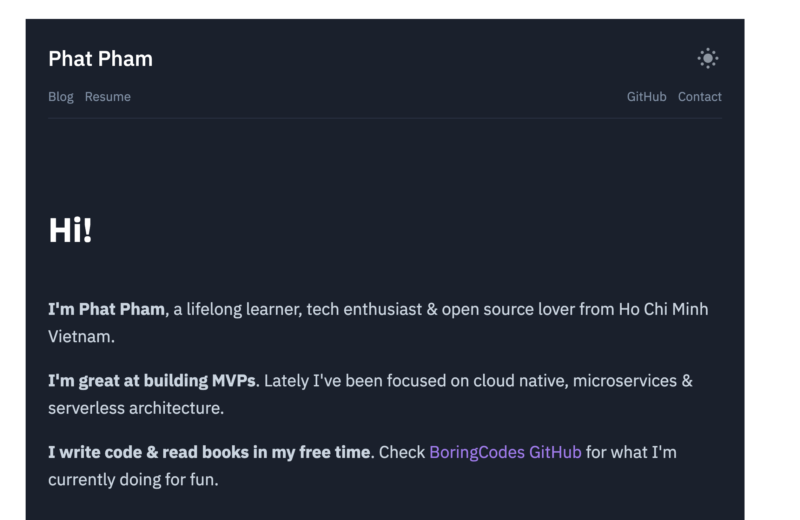

<div align="center">
  <h1>onroads.xyz</h1>
  <p>My personal website</p>

  <p>
    <a href="https://github.com/phatpham9/onroads.xyz/commits" aria-label="Commitizen Friendly">
      
    </a>
    <a href="https://david-dm.org/phatpham9/onroads.xyz" aria-label="Dependencies Status">
      
    </a>
    <a href="https://github.com/phatpham9/onroads.xyz/actions" aria-label="Build Status">
      
    </a>
    <a href="https://github.com/phatpham9/onroads.xyz/blob/master/LICENSE" aria-label="MIT License">
      
    </a>
  </p>

  
  
</div>

## Overview

- 🔧 Built on [GatsbyJS](https://www.gatsbyjs.com)
- 💅 Theme by [@lekoarts/gatsby-theme-minimal-blog](https://www.gatsbyjs.com/plugins/@lekoarts/gatsby-theme-minimal-blog)
- 🏠 Hosted on [GitHub](https://github.com/phatpham9/onroads.xyz)
- ✈️ Delivered by [CloudFlare Pages](https://pages.cloudflare.com)

## Installation

Use the package manager to install dependencies

```sh
$ yarn
```

## Development

Run the following command to start developing

```sh
$ yarn dev
```

## Deployment

Before running the app on production mode, we need to build the source by the following command

```sh
$ yarn build
```

Then start the app

```sh
$ yarn start
```

## Contributing

Pull requests are welcome. For major changes, please open an issue first to discuss what you would like to change.

Please make sure to update tests as appropriate.

## Authors

[Phat Pham](https://github.com/phatpham9)

## License

[MIT](https://github.com/phatpham9/onroads.xyz/blob/master/LICENSE)
